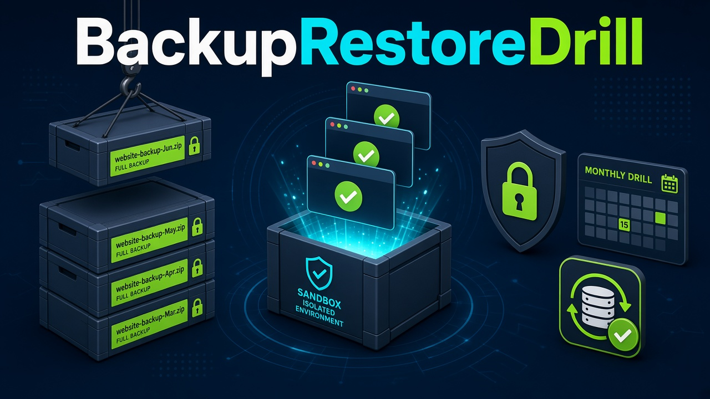

# BackupRestoreDrill

Once a month, prove that a Hostinger backup actually restores. The app unpacks a backup you already downloaded, serves it in a throwaway sandbox, checks the pages, writes a report, and deletes the sandbox.

## Quick start

1. Download or clone this repository.
2. Double-click the launcher:
   - macOS: `Launch BackupRestoreDrill.command`
   - Windows: `Launch BackupRestoreDrill.bat`
   - Linux: `./launch.sh`, or open `backuprestoredrill.desktop`
3. The first launch creates `.venv`, installs the pinned requirements, starts a local page on `127.0.0.1`, and opens it in your browser. Later launches skip the install.

Python 3.11 or newer is required. If Python is missing, the launcher tells you and links to [python.org](https://www.python.org/downloads/).

The example config drills a synthetic site at `examples/brochure`. Use **Run drill now** to see a pass. Then edit `data/config.yaml` and point `backup` at a real archive or folder. That file is created on first launch and is not committed.

## What a drill does

For each site in `data/config.yaml`:

1. Copy a folder, or extract a `.zip`, `.tar`, `.tar.gz`, or `.tgz`, into a scratch directory. Paths that would escape that directory are rejected.
2. Serve the files.
   - Static sites use nginx in Docker when Docker is running.
   - WordPress sites use `php:8.2-apache` plus `mariadb:11.4`. `wp-config.php` is pointed at the sandbox database, and the production URL in the SQL dump is rewritten to `http://127.0.0.1:<port>` (including PHP serialized string lengths). `WP_HOME` and `WP_SITEURL` are set to that same URL.
   - If Docker is missing, static sites fall back to Python's built-in web server. The dashboard explains how to install Docker. WordPress drills stop with that same message, because they need PHP and MariaDB.
3. Request the URLs you listed, and the sitemap when `use_sitemap` is true. The crawler only talks to `127.0.0.1`. Links that still use the production host are rewritten to the sandbox and checked there. Other hosts are not requested.
4. Record HTTP status, title text, body snippets, PHP error lines, broken internal links, and (for WordPress) whether MariaDB answers `SELECT 1`.
5. Write an HTML report and a row in `data/drills.sqlite`.
6. Stop the server or remove the containers and the scratch copy, including when a step fails.

The web UI lists each site, the last result, how old it is, and a warning when a site has not passed a drill in over 35 days. **Run drill now** streams a live log. The report shows pass or fail for each URL.

Nothing here changes production. There is no FTP, no SSH, and no DNS update. The published container port is bound to `127.0.0.1`. The database port is not published. The production hostname is mapped to `127.0.0.1` inside the sandbox so a stray request stays there.

## Hostinger API

Off by default (`hostinger.enabled: false`). Turn it on only if you want a read-only website list:

```bash
export HOSTINGER_API_TOKEN="paste-from-hpanel"
# or store it in the OS keychain, which is not written into the config:
python -m backuprestoredrill token set
python -m backuprestoredrill hostinger sites
```

The public API can list websites. It does not expose backup archives for Shared, Cloud, or Agency hosting. Download those from hPanel (files, and a SQL dump for WordPress) and set `backup` and `sql_dump` yourself. VPS backup metadata can be listed with `hostinger backups --vps-id <id>`. This app never calls a restore endpoint.

## Scheduling

Monthly runs stay off until you install one. They fire on day 15 at 09:00 and run `python -m backuprestoredrill drill --all`.

```bash
python -m backuprestoredrill schedule install macos
python -m backuprestoredrill schedule install windows
python -m backuprestoredrill schedule install linux
python -m backuprestoredrill schedule uninstall linux
```

That is launchd, Task Scheduler, or cron. The double-click launchers do not install a schedule. See `schedulers/README.md`.

## Dev setup

```bash
python3 -m venv .venv
.venv/bin/python -m pip install -r requirements-dev.txt
.venv/bin/python -m backuprestoredrill serve --no-browser
```

Useful commands:

```bash
python -m backuprestoredrill validate
python -m backuprestoredrill drill brochure --static-only
python -m backuprestoredrill drill --all
python -m backuprestoredrill cleanup
```

`cleanup` removes leftover containers and networks whose names start with `brd-`.

## Tests

```bash
.venv/bin/ruff check .
.venv/bin/pytest
```

The suite covers archive extraction and zip-slip protection, config validation, crawler checks against a local fixture, a WordPress restore with a mocked Docker client, teardown after a failed start or a failed crawl, the 35-day warning, launcher scripts, and an HTTP smoke test of the dashboard. GitHub Actions runs ruff and pytest on Linux and skips the packaged build.

## Packaged build

Optional. CI does not need it.

```bash
pip install pyinstaller
python scripts/build_app.py
```

On macOS this produces a `.app` using `assets/icon.icns`. On Windows it produces an `.exe` using `assets/icon.ico`. On Linux the script prints a skip message; pass `--skip` to exit 0. Icons are regenerated with `python scripts/make_icons.py` (needs `rsvg-convert` and Pillow).

## Privacy

- The UI and the sandbox listen on `127.0.0.1` only. There is no account and no cloud service.
- Config, reports, the SQLite history, and scratch restores live in `data/`, which is gitignored.
- The Hostinger token is read from `HOSTINGER_API_TOKEN` or the OS keychain. It is not written to YAML, SQLite, or the drill log.
- Fixtures and the example site use `example.test` names only.
- A successful drill deletes its scratch copy. The original backup file is not modified.

## Limitations

- Shared, Cloud, and Agency backup archives are not available from the Hostinger API. Download them in hPanel.
- Docker was not available in the environment used to build this repository, so a real nginx or WordPress container drill has not been run here. Static-only drills (Python's web server) have been run. WordPress container behavior is covered with a mocked Docker client.
- The macOS `.command` launcher and the Windows `.bat` launcher were not executed on those operating systems.
- The cron, launchd, and Task Scheduler installers were not registered on a machine during development. The tests check the files and commands they would write.
- SQL search-replace understands PHP `s:N:"..."` lengths in the dump text. A dump that backslash-escapes quotes inside serialized strings can still need a look. `WP_HOME` and `WP_SITEURL` override the home URL even so.
- Symlinks in a backup folder that point outside the folder are rejected. In-folder symlinks are skipped rather than copied.
- Containers sit on a private bridge. Only the web port is published, and only on `127.0.0.1`. Docker's bridge can still have outbound internet; the crawler never follows it, and the production host is pinned to loopback inside the container.
- Search-replace and the crawler do not log in to wp-admin or submit forms.
- `docs/cover.jpg` is a recreation of the cover artwork. The original image file was not in the repository when this was built. `assets/icon.svg` was redrawn from the small square in that cover's bottom-right corner and rasterized to PNG, ICO, and ICNS.
